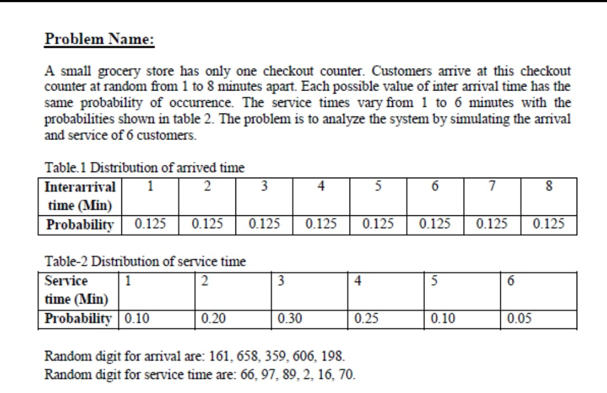

# Grocery Store Checkout Counter (Single Server Queue) Simulation

This project is a Python-based simulation of a single-server queuing model, specifically designed for a grocery store checkout counter. It follows the logic defined in **Table 2.10** of the textbook. The simulation calculates Inter-Arrival Times (IAT), Service Times (ST), Waiting Times (WT), and Server Idle Time based on random digit assignments and probability distributions.

## 📖 Problem Statement & Question
Below is the original problem statement from the textbook that this simulation solves:

## 📊 Logic & Formulas
The simulation follows these core queuing theory formulas:
- **Arrival Time (AT):** $AT_i = AT_{i-1} + IAT_i$
- **Time Service Begins (TSB):** $TSB_i = \max(AT_i, TSE_{i-1})$
- **Time Service Ends (TSE):** $TSE_i = TSB_i + ST_i$
- **Waiting Time (WT):** $WT_i = TSB_i - AT_i$
- **Time in System (TTS):** $TTS_i = WT_i + ST_i$
- **Idle Time:** $Idle = TSB_i - TSE_{i-1}$ (if $TSB_i > TSE_{i-1}$)

## 📗 Manual Excel Solution
Before implementing in Python, the problem was solved manually in Excel to verify the accuracy of the simulation logic:

## 🛠️ Technologies Used
- **Python 3.x**
- **Pandas:** For data manipulation and table management.
- **Google Colab:** For cloud-based execution and Google Drive integration.

## 🖥️ Final Python Simulation Output
The following table shows the final output generated by the Python script:

## 📁 File Structure
- `iat_table.csv`: Probability table for Inter-Arrival Times.
- `service_time_table.csv`: Probability table for Service Times.
- `Simulation_Lab.ipynb`: The main Python script (Jupyter Notebook).

## 📝 How to Run
1. Open the `.ipynb` file in Google Colab.
2. Ensure your Google Drive is mounted to save/load CSV files.
3. Run the cells sequentially to generate the tables and the final simulation result.
